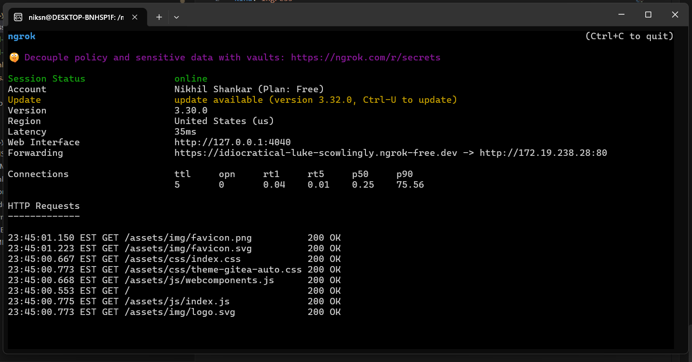
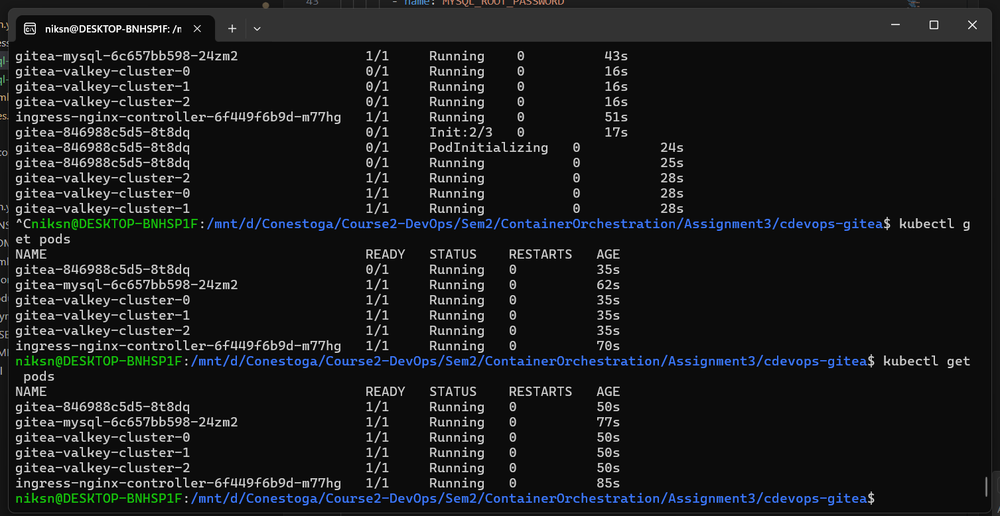

# Gitea Production Deployment on Kubernetes

**Assignment 3 - Orchestration with Gitea**  
Nikhil Shankar Chirakkal Sivasankaran
9026254

## Overview
Production-ready Gitea deployment on k3s Kubernetes cluster with MySQL database, persistent storage, and public access via ngrok.

## Prerequisites
- WSL2 (Ubuntu)
- Docker Desktop
- Python 3.x
- Ansible

## Quick Start

### 1. Install Dependencies
```bash
sudo apt update
sudo apt install -y ansible python3-kubernetes
```

### 2. Deploy Gitea
```bash
git submodule update --init --recursive
ansible-playbook up.yml
```

Wait for all pods to be ready:
```bash
kubectl get pods -w
```

### 3. Access Gitea Locally
Get ingress IP:
```bash
kubectl get ingress
```

Access via: `http://<INGRESS-IP>`


### 4. Setup Public Access with ngrok

Install ngrok:
```bash
curl -s https://ngrok-agent.s3.amazonaws.com/ngrok.asc | sudo tee /etc/apt/trusted.gpg.d/ngrok.asc >/dev/null
echo "deb https://ngrok-agent.s3.amazonaws.com buster main" | sudo tee /etc/apt/sources.list.d/ngrok.list
sudo apt update && sudo apt install ngrok
```

Authenticate (get token from https://ngrok.com):
```bash
ngrok config add-authtoken <YOUR_TOKEN>
```

Get ingress IP and expose:
```bash
kubectl get ingress  # Note the ADDRESS
ngrok http http://<INGRESS-IP>:80
```



Access Gitea publicly via the ngrok URL.


## Production Features

### ✅ Persistent Storage
- Gitea data stored in persistent volumes
- Survives pod restarts
- Configured in `gitea/values.yaml`

### ✅ MySQL Database
- External MySQL deployment
- Persistent storage for database
- Configuration: `gitea/mysql-deployment.yaml`



### ✅ Public Access
- Nginx Ingress Controller
- ngrok tunnel for external access
- Zero port-forwarding needed

## Teardown
```bash
ansible-playbook down.yml
```

## Architecture
```
User → ngrok → Ingress → Gitea Service → Gitea Pod
                              ↓
                         MySQL Service → MySQL Pod
                              ↓
                    Persistent Volumes (Data Storage)
```

## Key Files
- `up.yml` - Main deployment playbook
- `gitea/values.yaml` - Gitea Helm configuration
- `gitea/mysql-deployment.yaml` - MySQL manifest
- `gitea/ingress.yml` - Ingress configuration

---
